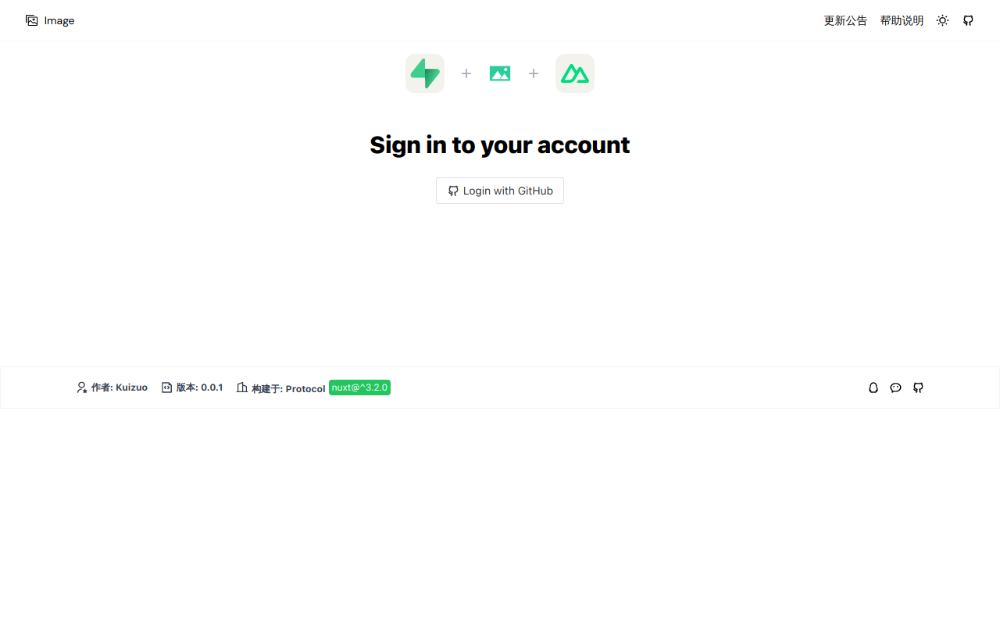
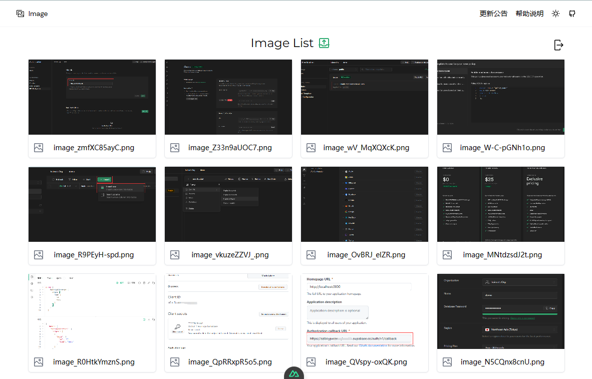

<p align="center">
  
</p>
<p align="center">
  <i>Artwork from <a href="https://nuxt.com/">Protocol</a></i>
</p>
<h1 align="center">Image hosting</h1>
<p align="center"> 🖼️ 使用 Supabase 搭建一个简易图床</p>

## 🎨 预览





## 🚀 快速开始

```
git clone https://github.com/kuizuo/image-hosting
cd image-hosting
```

将 .env.example 更改为 .env 并配置好 supabase 环境变量

```
SUPABASE_URL="https://example.supabase.com"
SUPABASE_KEY="<your_key>"
```

运行项目将会自动打开 http://localhost:8010

```
pnpm i
pnpm run dev
```

## 📝 License 

[MIT](./LICENSE) License
